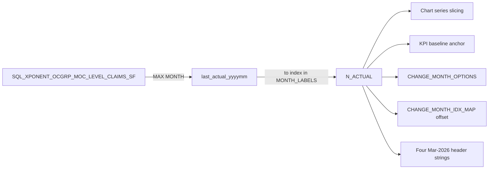

# Plan: Dynamic actuals cutoff from `SQL_XPONENT_OCGRP_MOC_LEVEL_CLAIMS_SF`

## Context (what I explored)
- The actuals boundary is controlled today by a single hardcoded constant `N_ACTUAL = 15` at [DSS_app.py:2322](DSS_app.py). Everything downstream references it.
- Data loading is centralized in `load_data()` at [DSS_app.py:2269-2299](DSS_app.py). Adding a fifth dataset load here is the natural place to compute the boundary.
- Downstream consumers of the boundary:
  1. `_series_actual = _base_full[:N_ACTUAL]` (chart)
  2. `_prechange_lo = max(N_ACTUAL - 1, 0)` (chart pre-change segment)
  3. `add_vrect(x0=N_ACTUAL - 1, ...)` (forecast shading)
  4. `natl_baseline_current = baseline_natl_ms[N_ACTUAL - 1]` (KPI)
  5. `mco_baseline_current = baseline_ms[N_ACTUAL - 1]` (KPI)
  6. `CHANGE_MONTH_IDX_MAP = {label: i + 15 ...}` at [DSS_app.py:2319](DSS_app.py) — hardcoded `+15`
  7. `CHANGE_MONTH_OPTIONS` at [DSS_app.py:2314-2318](DSS_app.py) — hardcoded list starting at "Apr 2026"
  8. Four hardcoded strings saying "Mar 2026" / "Jan 2025 - Mar 2026" / "as of Mar 2026" / "Data as of Mar 2026" at [DSS_app.py:2001, 2228, 2712, 2761](DSS_app.py)
- `MONTH_LABELS` and `MS_COLS` / `OCGRP_COLS` still cover the fixed Jan'25 → Dec'27 span. Per the user's instruction ("no other things get disturbed"), we leave those alone — only the actuals boundary becomes dynamic. If the underlying tables ever add columns past Dec'27, that is a separate, later change.
- User confirmed the source dataset is `SQL_XPONENT_OCGRP_MOC_LEVEL_CLAIMS_SF` and the column name is `MONTH`. Format not confirmed; the loader will parse defensively (int YYYYMM, string YYYYMM, ISO date, or python date/datetime — whichever comes back).

## Data flow



## Implementation steps

### 1. Add a MONTH parser and last-actual loader inside `load_data()`
Right after the four existing dataset loads (after `df_step`), add:
```python
# ---- Last-actual month (dynamic cutoff) ----
def _to_yyyymm(v):
    """Best-effort parse of a MONTH value into an int YYYYMM (e.g. 202603)."""
    if v is None or (isinstance(v, float) and pd.isna(v)):
        return None
    # datetime/date
    if hasattr(v, 'year') and hasattr(v, 'month'):
        return v.year * 100 + v.month
    s = str(v).strip()
    if not s:
        return None
    # pure digits
    digits = ''.join(ch for ch in s if ch.isdigit())
    if len(digits) >= 6:              # e.g. 202603 or 20260301
        return int(digits[:6])
    if len(digits) == 4:              # unlikely, but treat as YYYYMM missing pad
        return int(digits) * 100 + 1
    # try pandas
    try:
        dt = pd.to_datetime(s, errors='coerce')
        if pd.notna(dt):
            return dt.year * 100 + dt.month
    except Exception:
        pass
    return None

df_actuals_src = dataiku.Dataset("SQL_XPONENT_OCGRP_MOC_LEVEL_CLAIMS_SF").get_dataframe()
_yyyymm_values = [_to_yyyymm(v) for v in df_actuals_src['MONTH'].tolist()]
_yyyymm_values = [x for x in _yyyymm_values if x is not None]
last_actual_yyyymm = max(_yyyymm_values) if _yyyymm_values else 202603  # fallback = current hardcoded Mar 2026
```

Return `last_actual_yyyymm` from `load_data()` alongside the existing return values.

### 2. Compute `N_ACTUAL` dynamically after `load_data()` returns
Just below the `load_data()` call:
```python
df_market_share, df_ocgrp, ANALOG_CURVES, STEP_TABLE, LAST_ACTUAL_YYYYMM = load_data()

# Timeline anchors — Jan 2025 is index 0 in MONTH_LABELS
_TIMELINE_START_YYYYMM = 202501
def _yyyymm_to_idx(y):
    return (y // 100 - _TIMELINE_START_YYYYMM // 100) * 12 + (y % 100 - _TIMELINE_START_YYYYMM % 100)

N_ACTUAL = _yyyymm_to_idx(LAST_ACTUAL_YYYYMM) + 1     # inclusive index -> count
N_ACTUAL = max(1, min(N_ACTUAL, N_TOTAL))              # clamp defensively
```

Delete the old literal `N_ACTUAL = 15` line.

### 3. Derive `CHANGE_MONTH_OPTIONS` and `CHANGE_MONTH_IDX_MAP` from `N_ACTUAL`
Replace the hardcoded 21-entry list with:
```python
# Change month is any month strictly AFTER the last actual, up to end of timeline
def _yyyymm_from_idx(i):
    y = _TIMELINE_START_YYYYMM // 100 + (i // 12)
    m = (_TIMELINE_START_YYYYMM % 100) + (i % 12)
    if m > 12:
        y += 1; m -= 12
    return y, m

def _pretty(i):
    y, m = _yyyymm_from_idx(i)
    return f"{['Jan','Feb','Mar','Apr','May','Jun','Jul','Aug','Sep','Oct','Nov','Dec'][m-1]} {y}"

CHANGE_MONTH_OPTIONS = [_pretty(i) for i in range(N_ACTUAL, N_TOTAL)]
CHANGE_MONTH_IDX_MAP = {label: N_ACTUAL + i for i, label in enumerate(CHANGE_MONTH_OPTIONS)}
```
Note: `CHANGE_MONTH_IDX_MAP` offset is now `N_ACTUAL` (was hardcoded `+ 15`).

### 4. Replace the four hardcoded month strings
Introduce a single helper:
```python
LAST_ACTUAL_LABEL = MONTH_LABELS[N_ACTUAL - 1].replace("'", " 20")   # "Mar'26" -> "Mar 2026"
DATA_TIMELINE_LABEL = f"{MONTH_LABELS[0].replace(chr(39), ' 20')} - {LAST_ACTUAL_LABEL}"
```
Then swap:
- [DSS_app.py:2001](DSS_app.py) landing pill: `"Mar 2026"` → f-string using `LAST_ACTUAL_LABEL`
- [DSS_app.py:2228](DSS_app.py) rules-page timeline: `"Jan 2025 - Mar 2026"` → `DATA_TIMELINE_LABEL`
- [DSS_app.py:2712](DSS_app.py) KPI subtitle: `"as of Mar 2026 (last actual)"` → `f"as of {LAST_ACTUAL_LABEL} (last actual)"`
- [DSS_app.py:2761](DSS_app.py) footer stripe: `"Data as of Mar 2026"` → `f"Data as of {LAST_ACTUAL_LABEL}"`

Placement matters: `LAST_ACTUAL_LABEL` and `DATA_TIMELINE_LABEL` must be computed inside the agent branch, BEFORE the two rules-branch strings at lines 2001 and 2228 are rendered. Since the rules-page markdown at line 2228 is inside the `elif st.session_state.page == 'rules':` branch and the landing pill at 2001 is in the landing branch (both outside `load_data()`), I need to make `LAST_ACTUAL_LABEL` accessible in all three branches. Simplest fix: call the light-weight `load_data()` (already cached with `ttl=300`) at the top of the file / before the branch dispatch, or compute `LAST_ACTUAL_YYYYMM` in a small helper cached separately.

Concrete approach — add a tiny helper right after `load_data()` definition (still `@st.cache_data`):
```python
@st.cache_data(ttl=300)
def get_last_actual_label():
    _, _, _, _, y = load_data()
    idx = _yyyymm_to_idx(y)
    lbl = MONTH_LABELS[idx]  # e.g. "Mar'26"
    return lbl.replace("'", " 20")
```
Since `load_data()` is only defined inside the `agent` branch today, this helper also needs to be inside a small module-level (or top-of-`agent`-branch) scope that both landing and rules can call.

**Cleaner fix**: hoist a very small `get_last_actual_yyyymm()` helper to module level (outside any branch), reusing `dataiku.Dataset(...).get_dataframe()` directly, cached with `@st.cache_data(ttl=300)`. Call it from all three branches (landing, rules, agent). The heavier `load_data()` stays inside the agent branch untouched.

### 5. Verification
1. `python -m py_compile DSS_app.py` — must be clean.
2. Reload the app in Dataiku and check:
   - Landing pill shows current `LAST_ACTUAL_LABEL`
   - Rules → Data Timeline card shows `Jan 2025 - <LAST_ACTUAL_LABEL>`
   - Agent → KPI card subtitle: `as of <LAST_ACTUAL_LABEL> (last actual)`
   - Agent → footer stripe: `Data as of <LAST_ACTUAL_LABEL>`
   - Agent → chart: the shaded forecast region and pre-change/actual split lines up with `N_ACTUAL` (visually the boundary should move if the source dataset now has more actual months)
   - Agent → Change Month dropdown: first option is one month after `LAST_ACTUAL_LABEL`

## Critical files
- [DSS_app.py](DSS_app.py) — single file; changes concentrated near lines 2001, 2228, 2265-2325, 2712, 2761.

## Non-goals (explicitly untouched)
- `MONTH_LABELS`, `MS_COLS`, `OCGRP_COLS`, `N_TOTAL` — remain fixed at Jan'25 → Dec'27, 36 months. If actuals go past Dec'27, that requires a follow-up change (parse month columns from the DataFrame). Out of scope now per user's instruction.
- No changes to `apply_analog`, `compute_national_ms`, `get_mco_ms`, `get_mco_ocgrp`, `get_mco_metadata`, chart styling, KPI card layout, business-rules content, or landing/agent/rules navigation.
- No changes to Snowflake schema. Only requires that `SQL_XPONENT_OCGRP_MOC_LEVEL_CLAIMS_SF` be exposed as a Dataiku dataset accessible to the webapp.
